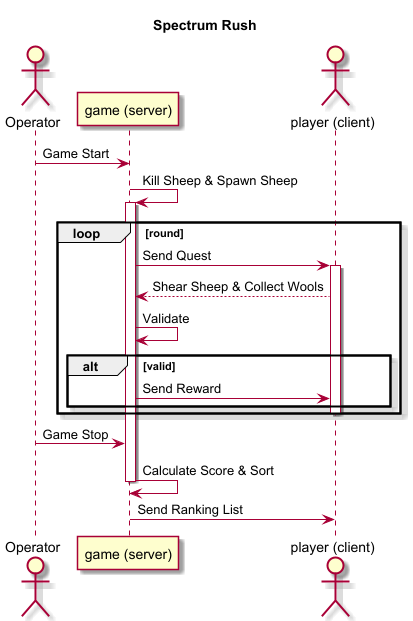

# Design Requirements (DR): Spectrum Rush

**Version:** 0.0.1+1.20.1

**Date:** 2025/09/16

**Author:** Liu Dongyu, Fuli_kk, ...

**Status:**

- [x] Draft
- [x] In Review
- [ ] Approved

**Issue Tracker:** [https://github.com/Viola-Siemens/Spectrum-Rush/issues](https://github.com/Viola-Siemens/Spectrum-Rush/issues)

---

### **1. Overview**

**1.1. Production Requirements**

[PRD](README.md)

**1.2. High-Level Design**

Nope.

**1.3. Glossary**

**1.4 Premise**

Nope.

### **2. Function Design**

**2.1. Entity Relationship Diagram**

**2.2. Class Diagram**

Nope.

**2.3. Sequence Diagram**

### **3. O & M Design**

**3.1. Grayscale Release**

Nope.

### **4. Permission Design**

| Description    | Operator | Creative Player | Survival Player | Adventure Player | Spectator |
|:---------------|:---------|:----------------|:----------------|:-----------------|:----------|
| Start the game | ✔ | ❌ | ❌ | ❌ | ❌ |
| Stop the game  | ✔ | ❌ | ❌ | ❌ | ❌ |
| Shear Sheep    | ✔ | ✔ | ✔ | ✔ | ❌ |
| Collect Wools  | ✔ | ✔ | ✔ | ✔ | ❌ |
| Score Points   | ✔ | ✔ | ✔ | ✔ | ❌ |
| *Dye Sheep?*   | ✔ | ✔ | ✔ | ✔ | ❌ |
| *Kill Sheep?*  | ✔ | ✔ | ✔ | ✔ | ❌ |